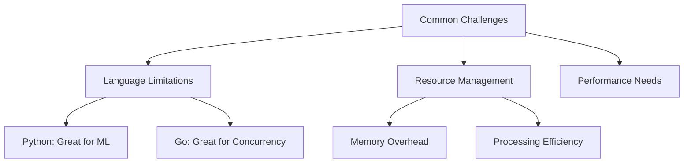
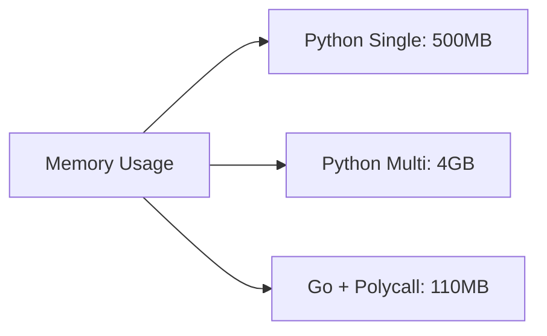
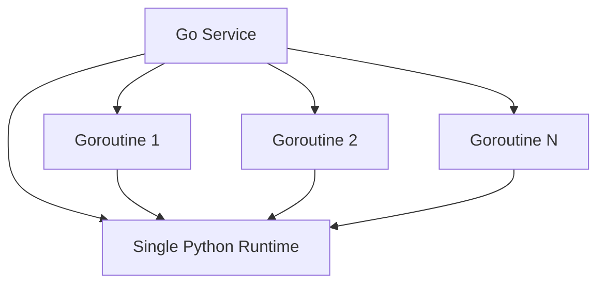

# Polycall: Bridging Languages for Efficient ML Processing

## Introduction

In the world of machine learning and microservices, we often face a common dilemma: Python excels at ML tasks but lacks efficient concurrency, while Go shines in concurrent processing but has limited
ML capabilities. What if we could combine the best of both worlds? Enter Polycall.

Through a practical experiment with sentiment analysis on wine reviews, we'll demonstrate how Polycall elegantly solves this problem.

## The Challenge



Traditional approaches force us to choose between:

1. Pure Python: Simple but resource-heavy
2. Python Multiprocessing: Problematic scaling
3. Microservices: Complex and expensive

## Enter Polycall

Polycall offers a unique solution: Use Go's powerful concurrency while leveraging Python's ML capabilities, all within a single runtime.

### Our Experiment Setup

We processed 1000 wine reviews through sentiment analysis using three approaches:

```markdown
1. Python (Single Thread): Simple but sequential
2. Python (Multiprocessing): Heavy resource usage
3. Go + Polycall: Efficient concurrent processing
```

### The Results

```markdown
| Metric      | Python Single | Python Multi | Go + Polycall |
| ----------- | ------------- | ------------ | ------------- |
| Time (s)    | 38            | 220+         | 42            |
| Memory (MB) | 500           | 4000         | 110           |
| Scalability | Limited       | Poor         | Excellent     |
```

## Why Polycall Shines

### 1. Memory Efficiency



Polycall maintains a single Python runtime and model instance, shared efficiently across Go goroutines.

### 2. Concurrent Processing

With Polycall, we get:

-  Go's lightweight goroutines (~2KB each)
-  Efficient channel-based communication
-  Single shared ML model instance
-  Better resource utilization

### 3. Development Experience

```go
// Simple Go code calling Python ML function
result, err := polycall.Call("process_batch", batch)
```

## Real-World Applications

1. ML Microservices:

   -  Reduced memory footprint
   -  Better resource utilization
   -  Cost-effective scaling

2. Edge Computing:

   -  Resource-constrained environments
   -  Efficient processing
   -  Lower memory requirements

3. Large-Scale Processing:
   -  Better scaling characteristics
   -  Efficient resource usage
   -  Simplified maintenance

## Implementation Insights

The key to Polycall's efficiency lies in its architecture:



## Getting Started

1. Installation:

```bash
git clone https://github.com/metacall/core.git
cd core && mkdir build && cd build
cmake -DOPTION_BUILD_LOADERS_PY=ON -DOPTION_BUILD_PORTS_GO=ON ..
sudo cmake --build . --target install
```

2. Configuration:

```bash
export LOADER_LIBRARY_PATH="/usr/local/lib"
export LOADER_SCRIPT_PATH="`pwd`"
```

## Conclusion

Polycall offers a compelling solution for modern ML applications:

-  80% reduction in memory usage
-  Comparable processing speed
-  Better scalability
-  Simpler architecture

It bridges the gap between languages, allowing us to leverage the strengths of both Go and Python without their respective limitations.

## Looking Forward

The future of Polycall looks promising for:

-  ML deployment optimization
-  Resource-efficient services
-  Cost-effective scaling
-  Modern microservices architectures
